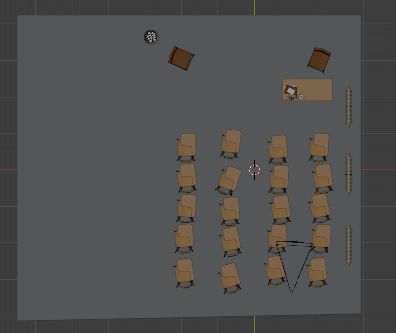

# Generate training data for object detection model

In this tutorial we will go over generating Object Detection data in Blender. 

* these scripts are tested in blender 2.81 and 2.83
 


Throughout the article I will be going over the following three scenarios

* Static or stationary objects
* Objects being spawned in
* Multiple unique objects


While these will not cover every scenario the methods provided can be combined to fit your specific use case. The following examples can be found in the `/classroom` folder of this repo. All the blender files are modified versions of the Class room file by Christophe Seux found at https://www.blender.org/download/demo-files/. If you are wondering what is modified from the default scene, the classroom is relatively ceneted in global space and a image texture is placed in the window. 

## Static object 
 


In this section we will be going over the general setup and functions that pull useful Object Decectition data with the assumption that the object in our scene will remain in the same position. This means the object wont change locations relative to the other objects in the scene. Another assumption will be that the camera can see the object in the scene regardless of where it is positioned. Later on in the tutorial we will cover the camera being obstructed by object in the scene. For now we will lay the basic groundwork of randomly spawning the camera and pulling object detection cordinates from our desired object.


**important !**

* if you see a bullet point bellow a function it indicates sections of importance


The following code is found in `/classroom/static.blend`

### imports
```python
import bpy
import json
from random import uniform
```

### update

This function is to update the environment after we move or change position of an object

```python
def update():
    dg = bpy.context.evaluated_depsgraph_get() 
    dg.update()
```


### randomize camera

This function randomly positions the camera in the x y and z cordinates that it takes as input

```python
def randomize_camera(scene, camera,  x, y, z):
    #uniform picks a float between two numbers
    x = uniform(-x, x)
    y= uniform(-y,y)
    #In this case we are not randomizing the z
    z = z

    # Set camera translation
    camera.location.x = x
    camera.location.y = y
    camera.location.z = z
    update()
    return scene
```

* For this example we will not be randomizing the z axis


### center obj

this centers the camera on the desired object

```python

def center_obj(camera, obj):
    point = obj.matrix_world.to_translation()
    loc_camera = camera.matrix_world.to_translation()

    direction = point - loc_camera
    # point the cameras '-Z' and use its 'Y' as up
    rot_quat = direction.to_track_quat('-Z', 'Y')
    
    # assume we're using euler rotation
    camera.rotation_euler = rot_quat.to_euler()
    update()
    
```

### offset

This function is used so that the object is not perfectly centered in frame. When creating training data it is important to note that convolutions dont work so well at the edges of an image. 

```python
def offset(scene, camera, angle):
    
    angle = uniform(-angle, angle)
    width = bpy.context.scene.render.resolution_x
    height = bpy.context.scene.render.resolution_y
    lens = bpy.data.cameras[camera.name].lens
    if width > height:    
        ratio = height / width  
        desired_x = (lens / 2) * (angle/100) * ratio
        desired_y = (lens / 2) * (angle/100) 
    
    elif height > width:
        ratio = width / height  
        desired_x = (lens / 2) * (angle/100)
        desired_y = (lens / 2) * (angle/100) * ratio
        
   
    scene.camera.rotation_mode = 'XYZ'
    x = scene.camera.rotation_euler[0]
    y = scene.camera.rotation_euler[2]
    
    change_x = x + (desired_x * (pi / 180.0))
    change_y = y + (desired_y * (pi / 180.0))
    scene.camera.rotation_euler[0] = change_x 
    scene.camera.rotation_euler[2] = change_y 
    update()

```


### get cordinates


*helpers
see https://olestourko.github.io/2018/02/03/generating-convnet-training-data-with-blender-1.html for this function. This will pull the outermost 3d cordinates of the object and return them in the form of percent pixel values of the image. 
```python
def camera_view_bounds_2d(scene, camera_object, mesh_object):
    """
    Returns camera space bounding box of the mesh object.
    Gets the camera frame bounding box, which by default is returned without any transformations applied.
    Create a new mesh object based on mesh_object and undo any transformations so that it is in the same space as the
    camera frame. Find the min/max vertex coordinates of the mesh visible in the frame, or None if the mesh is not in view.
    """

    #Get the inverse transformation matrix
    matrix = camera_object.matrix_world.normalized().inverted()
    #Create a new mesh data block, using the inverse transform matrix to undo any transformations
    dg = bpy.context.evaluated_depsgraph_get()
    ob = mesh_object.evaluated_get(dg) #this gives us the evaluated version of the object. Aka with all modifiers and deformations applied.
    mesh = ob.to_mesh()
    #mesh = mesh_object.to_mesh()
    mesh.transform(mesh_object.matrix_world)
    mesh.transform(matrix)

    #Get the world coordinates for the camera frame bounding box, before any transformations
    frame = [-v for v in camera_object.data.view_frame(scene=scene)[:3]]
    lx = []
    ly = []
    for v in mesh.vertices:
        co_local = v.co
        z = -co_local.z

        if z <= 0.0:
            #Vertex is behind the camera; ignore it
            continue
        else:
            #Perspective division
            frame = [(v / (v.z / z)) for v in frame]
        min_x, max_x = frame[1].x, frame[2].x
        min_y, max_y = frame[0].y, frame[1].y
        
        x = (co_local.x - min_x) / (max_x - min_x)
        y = (co_local.y - min_y) / (max_y - min_y)
        lx.append(x)
        ly.append(y)
    
    mesh_object.to_mesh_clear()
    # Image is not in view if all the mesh verts were ignored
    if not lx or not ly:
        return None
    min_x = np.clip(min(lx), 0.0, 1.0)
    min_y = np.clip(min(ly), 0.0, 1.0)
    max_x = np.clip(max(lx), 0.0, 1.0)
    max_y = np.clip(max(ly), 0.0, 1.0)

    #Image is not in view if both bounding points exist on the same side
    if min_x == max_x or min_y == max_y:
        return None
    return (min_x, min_y), (max_x, max_y)
```

### Write Cordinates
returns a json object with the 2d cordinate data of the box in the following json format
```python
def get_cordinates(scene, camera,  object, filename):
    camera_object = camera
    bounding_box = camera_view_bounds_2d(scene, camera_object, object)
    cordinates = {
            'image': filename,
            'meshes': {}
        }
    if bounding_box:
       cordinates['meshes'][object.name] = {
                    'x1': bounding_box[0][0],
                    'y1': bounding_box[0][1],
                    'x2': bounding_box[1][0],
                    'y2': bounding_box[1][1]
                }
       return cordinates
    else:
       return None
```
### Json returned
```json
[
    {
        "image": "image_name.jpg",
        "meshes": {
            "Object_ID": {
                "x1": 0.6286790958986577,
                "x2": 0.7885611171182803,
                "y1": 0.10051047409295591,
                "y2": 0.32216781638591024
            }
        }
    },
]
```

* if you place `scripts/visualize.py` into the directory with your renders and json file you can view the boxes generated by the get cordinates function. simply type `python3 visualize.py` in the directory. All the example box cordinate images are generated with this python file.

### Batch Render

With all this we can loop through the data and write out the image to a folder. 


```python
def batch_render(img_count=1, file_prefix="render", image_dir="./renders/"):

    #Set objects
    object = bpy.data.objects["Suzanne"]
    scene = bpy.context.scene
    camera = bpy.data.objects['Camera']

    labels = []
    for i in range(img_count):

        # take note of cordinates as they relate to blenders 3d space
        scene = randomize_camera(scene, camera, 2.5, 3.5, 1.7)
        center_obj(camera, object)
        offset(scene, camera, 60)
        
        # checks whether your output is jpeg or png
        file_format = scene.render.image_settings.file_format.lower()
        
        filename = f'{file_prefix}-{str(i)}.{file_format}'
        
        #write image out
        bpy.context.scene.render.filepath = f'{image_dir}{filename}'
        bpy.ops.render.render(write_still=True)
        
        #pull cordinates
        scene_labels = get_cordinates(scene, camera, object, filename)
        labels.append(scene_labels) 

    with open(f'{image_dir}labels.json', 'w+') as f:
        json.dump(labels, f, sort_keys=True, indent=4, separators=(',', ': '))


```
* important to note here is the image directory declaration in the function.Along with this comes the randomize camera cordinates which will vary for your scene. Lastly is the object and camera definitions, which may vary in your project.

### Run it 

specify the number of images you want generated and run the function

`batch_render(img_count=4)`

* images may take a while to render but you will see them appear in the designated render folder


### Randomly spawn Objects

 


in `/classroom/static.blend`

In this section we will randomly spawn and rotate our object. Along with this we will frame advance to make use of blenders physics simulation. 

Most of the functions used are from the first project but there are a few new ones to account the object spawn. Along with this we will be adding a check to make sure the object is visible to our camera.


## Scene setup

in order to properly make use of blenders physics sim to render object detection images the scene must be changed a bit from a previous example. This is already done in the example file but the instructions are included here. 

The floor, chairs,  desk and objects pictured below have a rigid body physics property applied with the passive type.
 

Our object of interest has a rigid body active property applied to it. 

The chairs and a few other objects are moodified so their mesh properties can be captured and have physics properties applied. 

### new imports

```python

```


### randomize_obj
place object at random location

```python

def randomize_obj(obj, x, y, z):
    
    roll = uniform(0, 90)
    pitch = uniform(0, 90)
    yaw = uniform(0, 90)
    obj.rotation_mode = 'XYZ'
    obj.rotation_euler[0] = pitch*(pi/180.0)
    obj.rotation_euler[1] = roll*(pi/180)
    obj.rotation_euler[2] = yaw*(pi/180.0)
    
    obj.location.x = uniform(-x, x)
    obj.location.y = uniform(-y, y)
    obj.location.z = z

```

* here I am not randomizing the z axis so our active object can fall on to the passive ones and we wont have any mesh collisions

## increment frames
loop through physics simulation frames


```python
def increment_frames(scene, frames):
    for i in range(frames):
        scene.frame_set(i)

```

## get raycast percentage
When running the object through blenders physics simulation or simply randomly spawning it without specific constraints there is a chance the object will be obstructed from the camera.

In order to solve this problem the raycast fuction below is used. This function cast rays at each of the object vertices and compares them to where the ray is hit. 


#### Rays cast at every vertex

  


The example above ignores the mesh however, If we take the mesh into account somewhere around 50% of the rays hit. 

#### rays that actually make contact with each vertex

  

* percent hit: 46%

* To note: this value can be less or greater than 50% if the object is not fully symmetrical and is rotated in a way where more or less vertices are shown. 


#### ray cast with object obstruction

  

* percent hit: 15%

The value returned from the funtion will be the percentage of rays hit. Therefore if the object is fully obstructed this will be 0%


#### the functiomns below are helpers 
```python

def BVHTreeAndVerticesInWorldFromObj( obj ):
    mWorld = obj.matrix_world
    vertsInWorld = [mWorld @ v.co for v in obj.data.vertices]

    bvh = BVHTree.FromPolygons( vertsInWorld, [p.vertices for p in obj.data.polygons] )

    return bvh, vertsInWorld

# Deselect mesh polygons and vertices
def DeselectEdgesAndPolygons( obj ):
    for p in obj.data.polygons:
        p.select = False
    for e in obj.data.edges:
        e.select = False
```

#### get raycast percentage function
This returns a true or false value depending whether or not the threshold is hit. Along with this it also returns the percentage hit 
```python
def get_raycast_percentage(scene, cam, obj, cutoff, limit=.0001):
    # Threshold to test if ray cast corresponds to the original vertex
    viewlayer = bpy.context.view_layer
    # Deselect mesh elements
    DeselectEdgesAndPolygons( obj )
    # In world coordinates, get a bvh tree and vertices
    bvh, vertices = BVHTreeAndVerticesInWorldFromObj( obj )
    same_count = 0 
    count = 0 
    for i, v in enumerate( vertices ):
        count += 1
        # Get the 2D projection of the vertex
        co2D = world_to_camera_view( scene, cam, v )

        # By default, deselect it
        obj.data.vertices[i].select = False
        
        # If inside the camera view
        if 0.0 <= co2D.x <= 1.0 and 0.0 <= co2D.y <= 1.0: 
            # Try a ray cast, in order to test the vertex visibility from the camera
            location, normal, index, distance, t, ty = scene.ray_cast(viewlayer, cam.location, (v - cam.location).normalized() )
            t = (v-normal).length
            if t < limit:
                same_count += 1
    del bvh
    ray_percent = same_count/ count
    if ray_percent > cutoff/ 100:
        value = True
    else:
        value = False
    return value, ray_percent 
```
## change in batch_render

In order to make sure the object in frame we check the the raycast percentage. If it reaches a threshold less than our cutoff we will start the loop again otherwise the images will be rendered as usual. I also modified this to be a generator becauseit is more data efficient than a list, but this function could be a standard loop.


```python
def batch_render(img_count=1, image_dir="./renders/", file_prefix="render"):
    
        value = True
        object = bpy.data.objects["Suzanne"]
        scene = bpy.context.scene
        camera = bpy.data.objects['Camera']

        while loop_count != img_count:

            randomize_obj(object, 2.5, 3.5, 1.7)
            scene = randomize_camera(scene, camera, 2.5, 3.5, 1.7)
            increment_frames(scene, 40)
            center_obj(camera, object)
            offset(scene, camera, 80)
            value, percent = get_raycast_percentage(scene, camera, object, 15)
            
            if value == False:
                    loop_count -= 1
                    value = True
            else:
                    file_format = scene.render.image_settings.file_format.lower()
                    filename = f'{file_prefix}-{str(loop_count)}.{file_format}'
                    
                    #write image out
                    bpy.context.scene.render.filepath = f'{image_dir}{filename}'
                    bpy.ops.render.render(write_still=True)
                    
                    
                    #pull cordinates
                    scene_labels = get_cordinates(scene, camera, object, filename)
                    
                    yield scene_labels

            loop_count += 1

```
* again note the object and camera being defined, the location calls for `randomize_obj()` and `randomize_camera()`, the number of frames passed to `increment_frames()` and the cutoff for `get_raycast_percentage()`


### Run it 

specify tthe number of images you want generated and run the function

```python
image_dir = "./renders/"

# returns just the labels
labels = list(batch_render(img_count=3))

# Write them out
with open(f'{image_dir}/labels.json', 'w+') as f:
    json.dump(labels, f, sort_keys=True, indent=4, separators=(',', ': '))
```


## Tips

remember to enable CUDA gpu devices in edit -> preferences -> system

